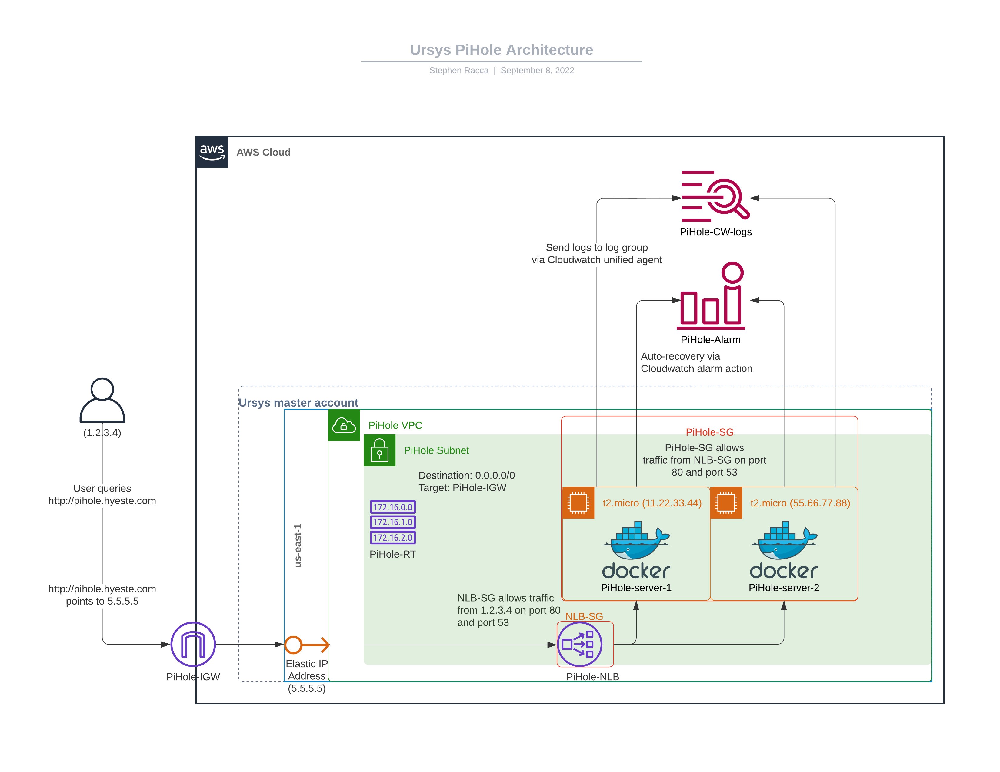

# Architecture

*   AWS Organizations
    *   Run PiHole server from Master Account
        *   Run containerised PiHole server from 2 EC2 instances(1)
        *   Run PiHole server behind Network Load Balancer (2)
            *   Attach 1 Elastic IP(2) address to Network Load Balancer(3)
            *   Network Load Balancer is in security group “NLB-SG”, allows traffic from user IP on port 80 and port 53          
            *   Instances are in security group “PiHole-SG”, allows traffic from security group “NLB-SG” on port 80 and port 53
        *   Network Load Balancer, EC2 instances, “NLB-SG”, and “PiHole-SG” are in subnet “PiHole-Subnet”
            *   “PiHole-Subnet” is in VPC “PiHole-VPC”
        *   Store container logs in CloudWatch Log Group “PiHole-CW-logs”(4)
        *   Auto-recovery via CloudWatch alarm “PiHole-Alarm” with alarm action Recover

# Pricing

1.  EC2 pricing within us-east-1 [(from AWS Pricing Calculator - Configure Amazon EC2)](https://calculator.aws/#/addService/EC2): 
    *   2 t2.micro Linux instances x 0.0116 USD per hour x 730 hours in a month = 16.94 USD per month (onDemand cost)
    *   8 GB EBS storage x 0.10 USD x 2 instances = 1.60 USD per month
    *   Run instances for 4 months = 97.27 CAD  

2.  Network Load Balancer pricing within us-east-1 (from [AWS Pricing Calculator - Configure Elastic Load Balancing](https://calculator.aws/#/addService/ElasticLoadBalancing)):
    *  1 load balancers x 0.0225 USD x 730 hours in a month = 16.43 USD
    *  0.0068493 GB per hour / 1 GB processed bytes per hour per LCU = 0.0068493 TCP processed bytes LCUs  
        Max (0.0068493 TCP processed bytes LCUs, 0 new TCP connections LCUs, 0 active TCP connections LCUs) = 0.0068493 max TCP LCUs  
        0.0068493 TCP LCUs x 0.006 NLB LCU price x 730 hours per month = 0.03 USD (for TCP Traffic per Network Load Balancer)  
        0.0068493 GB per hour / 1 GB processed bytes per hour per LCU = 0.0068493 UDP processed bytes LCUs  
        Max (0.0068493 UDP processed bytes LCUs, 0 new UDP Flow LCUs, 0 active UDP Flow LCUs) = 0.01 max UDP LCUs  
        0.01 UDP LCUs x 0.006 NLB LCU price x 730 hours per month = 0.04 USD (for UDP Traffic per Network Load Balancer)  
        0.0068493 GB per hour / 1 GB processed bytes per hour per LCU = 0.0068493 TLS processed bytes LCUs  
        Max (0.0068493 TLS processed bytes LCUs, 0 new TLS connections LCUs, 0 active TLS connections LCUs) = 0.01 max TLS LCUs  
        0.01 TLS LCUs x 0.006 NLB LCU price x 730 hours per month = 0.04 USD (for TLS Traffic per Network Load Balancer)  
        0.03 USD (for TCP Traffic per Network Load Balancer) + 0.04 USD (for UDP Traffic per Network Load Balancer) + 0.04 USD (for TLS Traffic per Network Load Balancer) = 0.11 USD (total LCU cost per Network Load Balancer)  
        1 Network Load Balancers x 0.11 USD = 0.11 USD
    *  Run NLB for 4 months = 86.78 CAD  

3.  Elastic IP address pricing (from [EC2 On-Demand Instance Pricing](https://aws.amazon.com/ec2/pricing/on-demand/#Elastic_IP_Addresses)):
    *  _You can have one Elastic IP (EIP) address associated with a running instance at no charge. If you associate additional EIPs with that instance, you will be charged for each additional EIP associated with that instance per hour on a pro rata basis. Additional EIPs are only available in Amazon VPC._  
        
4.  CloudWatch logs pricing within us-east-1 (from [AWS Pricing Calculator - Configure Amazon CloudWatch](https://calculator.aws/#/addService/CloudWatch)): 
    *  5 GB x 0.50 USD = 2.50 USD  
        Standard Logs Data Ingested cost: 2.50 USD CloudWatch Logs Data Ingested tiered pricing cost: 0 USD  
        5.00 GB per month x 0.15 Storage compression factor x 1 Logs retention factor x 0.03 USD = 0.0225 USD  
        Standard/Vended Logs data storage cost: 0.0225 USD  
        Logs delivered to S3 Data Ingested cost: 0 USD  
        Logs converted to Apache Parquet format cost: 0 USD  
        2.50 USD + 0.0225 USD = 2.5225 USD  
        CloudWatch Logs Ingested and Storage cost (monthly): 2.52 USD
    *  4 months CloudWatch logs = 13.24 CAD
         
5.  CloudWatch alarms pricing within us-east-1 (from [AWS Pricing Calculator - Configure Amazon CloudWatch](https://calculator.aws/#/addService/CloudWatch)): 
    *  1 Dashboards x 0.0000000000 USD = 0.00 USD  
        Total tier cost = 0.00 USD (Dashboards cost)
    *  1 alarms x 0.10 USD = 0.10 USD per month (Standard Resolution Alarms cost)
    *  4 months Cloudwatch dashboard and alarm: 0.52 CAD
