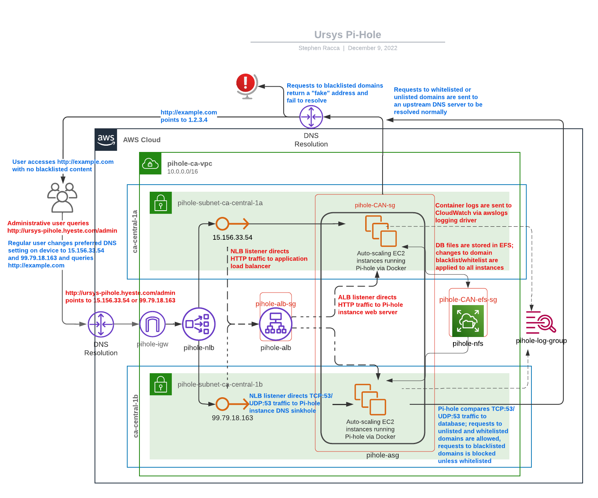

# Ursys Pi-hole
A containerised [Pi-hole  DNS sinkhole](https://github.com/pi-hole/pi-hole) arranged for Ursys LLC. This service and its surrounding architecture meet the following specifications: 

- The Pi-Hole service is hosted in AWS
- The Pi-Hole service runs from a container
- The Pi-Hole service container logs are stored in a CloudWatch Log Group
- The service architecture utilises load balancing technology
- The service architecture enables the Pi-Hole service to auto-recover following unexpected shutdown or hardware failure

## Usage



A regular Pi-hole user utilises this service by changing their device's preferred IPv4 DNS settings to "15.156.33.54" and "99.79.18.163". IPv6 network connectivity should be disabled if applicable. The Pi-hole blocks unwanted content (such as advertisements or web trackers) by intercepting DNS traffic and comparing requests to a blacklist containing domains known to host such content and a whitelist containing domains a user would like to resolve such content from. If a request matches a blacklisted domain, the Pi-hole returns a "fake" address that will fail to resolve. If a request does not match any blacklisted domains, or matches a blacklisted domain but also matches a whitelisted domain, it is sent to a public upstream domain to be resolved normally.

An administrative Pi-hole user configures the Pi-hole by accessing [ursys-pihole.hyeste.com](http://ursys-pihole.hyeste.com) and providing the correct password. Once logged in, settings such as the upstream domain or which domains are blacklisted or whitelisted can be changed. To prevent a user from being logged out while configuring the Pi-hole, administrative traffic is routed to the same server for ten minutes following the most recent request. Settings changed on one server are automatically copied to other servers.

## Service Architecture

The service architecture is made up of the following components:

### Networking

The VPC `pihole-ca-vpc` is hosted in ca-central-1, has the default VPC settings except for "DNS hostnames: Enabled", and is assigned the IPv4 CIDR block 10.0.0.0/16. It has two public subnets, `pihole-subnet-ca-central-1a` and `pihole-subnet-ca-central-1b`, which are located in the Availability zones ca-central-1a and ca-central-1b respectively. Both subnets have the default public subnet settings except for "Auto-assign public IPv4 address: Yes". `pihole-ca-vpc` also has the internet gateway `pihole-igw`, the route table `pihole-ca-rt`, the DHCP option set `pihole-DHCP`, the elastic IP addresses `pihole-eip-1a` and `pihole-eip-1b`, the NACL `pihole-nacl`, and the security groups `pihole-CAN-sg`, `pihole-CAN-efs-sg`, and `pihole-asg-sg`. `pihole-DHCP` and `pihole-nacl` both have default values. `pihole-ca-rt` routes local traffic to the `pihole-ca-vpc` CIDR and routes all other IPv4 traffic to `pihole-igw`.

While running the Pi-hole, `pihole-ca-vpc` has eight network interfaces. Interfaces with names ending in "-1a" or "-1b" are located in `pihole-subnet-ca-central-1a` or `pihole-subnet-ca-central-1b` respectively. Two unnamed interfaces are attached to the Pi-hole instances and delete on instance termination; replacement interfaces are automatically created and attached when more instances are launched. `pihole-efs-mount-1a` and `pihole-efs-mount-1b` are attached to the EFS filesystem `pihole-nfs`. `pihole-nlb-node-1a` and `pihole-nlb-node-1b` are nodes for the network load balancer `pihole-nlb`. `pihole-alb-node-1a` and `pihole-alb-node-1b` are nodes for the application load balancer `pihole-alb`.

### EC2

The Pi-hole runs from two t2.micro EC2 instances, which each run a [Pi-hole server from a Docker container](https://hub.docker.com/r/pihole/pihole/) created via Compose. Instances run the Amazon Linux 2 AMI `pihole-ami` and create volumes using the EBS snapshot `pihole-snapshot`. The EFS file system `pihole-nfs` is automatically mounted to instances and stores Pi-hole database files. Container logs are sent to CloudWatch using the Docker logging driver [awslogs](https://docs.docker.com/config/containers/logging/awslogs/).

Pi-hole instances are launched through the auto-scaling group `pihole-asg`, which uses the launch template `pihole-template`. It is configured to launch t2.micro instances that run `pihole-ami`, use the key pair file `ursys.pem`, use the security group `pihole-CAN-sg`, and are assigned the IAM instance profile `pihole-logging-role`. `pihole-asg` launches instances into `pihole-ca-vpc` subnets `pihole-subnet-ca-central-1a` and `pihole-subnet-ca-central-1b`. The desired number of instances, minimum number of instances, and maximum number of instances are all two. `pihole-asg` is attached to the network load balancer `pihole-nlb` and the application load balancer `pihole-alb`.

After being launched, traffic to instances is balanced by `pihole-nlb` and `pihole-alb`. `pihole-nlb` has cross-zone load balancing enabled and has two elastic IP addresses associated: `pihole-eip-1a` is attached to `pihole-nlb-node-1a` and holds the IPv4 address 15.156.33.54; `pihole-eip-1b` is attached to `pihole-nlb-node-1b` and holds 99.79.18.163. `pihole-nlb` listens for TCP traffic on port 80 as well as TCP and UDP traffic on port 53. Traffic on port 80 is forwarded to the ALB-type target group `pihole-tg-alb`, which directs traffic to `pihole-alb`. Traffic on port 53 is forwarded to the instance-type target group `pihole-tg-dns`, which is routed to instances. `pihole-alb` listens for HTTP traffic on port 80 and forwards it to `pihole-tg-http`, which is routed to instances. Sticky sessions are enabled for `pihole-tg-http` for ten minutes using the load balancer cookie type.

### Volumes and Network File System

Pi-hole instances use EBS volumes created from the EBS snapshot `pihole-snapshot`, which was created after running the following commands on a t2.micro EC2 instance running [Amazon Linux 2 AMI (HVM) - Kernel 5.10, SSD Volume Type](https://aws.amazon.com/marketplace/pp/prodview-zc4x2k7vt6rpu).

In order, these commands perform the following functions: 

- update YUM, install Docker, start the Docker service, add the default user to the "docker" group, install the Amazon EFS client, create the directory `/home/ec2-user/efs` and mount `pihole-nfs` to it, edit `/etc/fstab` to mount `pihole-nfs` on instance boot, install the Compose plugin and create associated directories, enable the Docker service to start on instance boot, create the `docker-compose.yml` build file, start the containerised Pi-hole service

```
sudo yum update -y && sudo amazon-linux-extras install docker -y && sudo service docker start && sudo usermod -a -G docker ec2-user && sudo yum install -y amazon-efs-utils && mkdir efs && sudo mount -t efs -o tls fs-0dfebd13114c47b28:/ efs && sudo echo "fs-0dfebd13114c47b28.efs.ca-central-1.amazonaws.com:/ /home/ec2-user/efs nfs4 nfsvers=4.1,rsize=1048576,wsize=1048576,hard,timeo=600,retrans=2,noresvport,_netdev 0 0" >> /etc/fstab
```
```
DOCKER_CONFIG=${DOCKER_CONFIG:-$HOME/.docker} && mkdir -p $DOCKER_CONFIG/cli-plugins && curl -SL https://github.com/docker/compose/releases/download/v2.11.2/docker-compose-linux-x86_64 -o $DOCKER_CONFIG/cli-plugins/docker-compose && chmod +x $DOCKER_CONFIG/cli-plugins/docker-compose && sudo systemctl enable docker
```
```
touch docker-compose.yml && echo 'version: "3"

# More info at https://github.com/pi-hole/docker-pi-hole/ and https://docs.pi-hole.net/]
services:
  pihole:
    container_name: pihole
    image: pihole/pihole:latest
    # For DHCP it is recommended to remove these ports and instead add: network_mode: "host"
    ports:
      - "53:53/tcp"
      - "53:53/udp"
    # - "67:67/udp" # Only required if you are using Pi-hole as your DHCP server
      - "80:80/tcp"
    environment:
      TZ: 'Canada/Vancouver'
      WEBPASSWORD: '[my-secure-password]'
    # Volumes store your data between container upgrades
    volumes:
      - './efs/etc-pihole:/etc/pihole'
      - './efs/etc-dnsmasq.d:/etc/dnsmasq.d'
    #   https://github.com/pi-hole/docker-pi-hole#note-on-capabilities
    #cap_add:
      - NET_ADMIN # Required if you are using Pi-hole as your DHCP server, else not needed
    logging:
      driver: "awslogs"
      options:
        awslogs-region: "ca-central-1"
        awslogs-group: "pihole-log-group"
        awslogs-stream: "pihole-stream"
    restart: always
' >> docker-compose.yml && docker compose up -d
```

The containerised Pi-hole accesses volumes located in the directory `/home/ec2-user/efs`, which is the mount point for `pihole-nfs`. Changes to database files such as the domain blacklist or whitelist on one server synchronise with all other servers. `pihole-nfs` is automatically mounted to instances on boot using the EFS mount helper and the `/etc/fstab` file. 

### Logging, IAM roles, and security groups

Pi-hole servers use awslogs to send container logs to CloudWatch. Logs are contained in the log stream `pihole-stream`, which is stored in the log group `pihole-log-group`.

Instances access CloudWatch using permissions granted through the IAM role `pihole-logging-role`. The AWS managed policy [CloudWatchAgentServerPolicy](https://github.com/SummitRoute/aws_managed_policies/blob/master/policies/CloudWatchAgentServerPolicy) is attached to this role.

The Pi-hole architecture uses the security groups `pihole-CAN-sg`, `pihole-CAN-efs-sg`, and `pihole-alb-sg` to control what network traffic is allowed. The rules listed here use the placeholder address "1.2.3.4/32" to indicate the end user's IPv4 address. Rules refer to both inbound and outbound traffic unless otherwise specified.

- `pihole-CAN-sg`, used by Pi-hole instances, allows the following traffic:

  - TCP:22 | 1.2.3.4/32 | Allows inbound SSH traffic from user IP
  - UDP:53 | 1.2.3.4/32 | Allows inbound DNS (UDP) traffic from user IP
  - TCP:53 | 1.2.3.4/32 | Allows inbound DNS (TCP) traffic from user IP
  - UDP:53 | 10.0.0.0/16 | Allows local inbound DNS (UDP) traffic for NLB health checks
  - TCP:53 | 10.0.0.0/16 | Allows local inbound DNS (TCP) traffic for NLB health checks
  - TCP:80 | `pihole-alb-sg` | Allows inbound HTTP traffic from ALB security group for health checks
  - TCP:2049 | `pihole-CAN-efs-sg` | Allows NFS traffic from EFS security group 
  - All traffic | 0.0.0.0/0 | Allows all outbound IPv4 traffic

- `pihole-CAN-efs-sg`, used by `pihole-nfs`, allows the following traffic:

  - TCP:2049 | `pihole-CAN-sg` | Allows NFS traffic from instance security group


- `pihole-alb-sg`, used by `pihole-alb`, allows the following traffic:

  - TCP:80 | 1.2.3.4/32 (Inbound only) | Allows inbound HTTP traffic from user IP address
  - TCP:80 | `pihole-CAN-sg` | Allows inbound HTTP traffic from `pihole-CAN-sg`

## Pricing

All prices are for resources within ca-central-1.

### EC2 resources

EC2 onDemand  (from [AWS Pricing Calculator](https://calculator.aws/#/addService/EC2)): 

    - 2 t2.micro Linux instances x 0.0128 USD per hour x 730 hours in a month = 18.69 USD per month
    - 8 GB EBS storage x 0.10 USD x 2 instances = 1.76 USD per month
    - Run instances for 4 months = 111.27 CAD  

Application Load Balancer (from [AWS Pricing Calculator](https://calculator.aws/#/addService/ElasticLoadBalancing)):

    - 1 load balancers x 0.02475 USD per hour x 730 hours in a month = 18.07 USD per month
      - Processed bytes (EC2 Instances and IP addresses as targets): .25 GB per month x 0.00136986 months in an hour = 0.000342465 GB per hour
      - Average connection duration: 10 minutes = 600 seconds
      - 0.000342465 GB per hour / 1 GB processed bytes per hour per LCU for EC2 instances and IP addresses as targets = 0.000342465 processed bytes LCUs for EC2 instances and IP addresses as targets
      - 0 rules per request - 10 free rules = -10 paid rules per request after 10 free rules
      - Max (-10 USD, 0 USD) = 0.00 paid rules per request
      - Max (0.000342465 processed bytes LCUs, 0 new connections LCUs, 0 active connections LCUs, 0 rule evaluation LCUs) = 0.000342465 maximum LCUs
      - 1 load balancers x 0.000342465 LCUs x 0.0088 LCU price per hour x 730 hours per month = 0.00 USD
      - Application Load Balancer LCU usage charges (monthly): 0.00 USD
    - Run application load balancer for 4 months = 98.32 CAD

Network Load Balancer (from [AWS Pricing Calculator](https://calculator.aws/#/addService/ElasticLoadBalancing)):

    - 1 load balancers x 0.02475 USD x 730 hours in a month = 18.07 USD
    - Processed bytes per NLB for TCP: 0.25 GB per month x 0.00136986 months in an hour = 0.000342465 GB per hour
    - Average number of new TCP connections: 10 per minute / (60 seconds in a minute) = 0.17 per second
    - Processed bytes per NLB for UDP: 0.25 GB per month x 0.00136986 months in an hour = 0.000342465 GB per hour
    - Average number of new UDP Flows: 10 per minute / (60 seconds in a minute) = 0.17 per second
    - 0.000342465 GB per hour / 1 GB processed bytes per hour per LCU = 0.000342465 TCP processed bytes LCUs
    - 0.17 new TCP connections / 800 connections per LCU = 0.0002125 new TCP connections LCUs
    - 0.17 new TCP connections x 1 seconds = 0.17 active TCP connections
    - 0.17 active TCP connections / 100000 connections per LCU = 0.0000017 active TCP connections LCUs
    - Max (0.000342465 TCP processed bytes LCUs, 0.0002125 new TCP connections LCUs, 0.0000017 active TCP connections LCUs) = 0.000342465 max TCP LCUs
    - 0.000342465 TCP LCUs x 0.0066 NLB LCU price x 730 hours per month = 0.00 USD (for TCP Traffic per Network Load Balancer)
    - 0.000342465 GB per hour / 1 GB processed bytes per hour per LCU = 0.000342465 UDP processed bytes LCUs
    - 0.17 new UDP Flows / 400 new flows per sec = 0.000425 new UDP Flow LCUs
    - 0.17 new UDP Flows x 3 seconds = 0.51 active UDP Flows
    - 0.51 active UDP Flows / 50000 active flows per LCU = 0.00001 active UDP Flow LCUs
    - Max (0.000342465 UDP processed bytes LCUs, 0.000425 new UDP Flow LCUs, 0.000010 active UDP Flow LCUs) = 0.00 max UDP LCUs
    - Max (0 TLS processed bytes LCUs, 0 new TLS connections LCUs, 0 active TLS connections LCUs) = 0.00 max TLS LCUs
    - Total LCU charges for all Network Load Balancers (monthly): 0.00 USD
    - Run network load balancer for 4 months = 98.32 CAD

AMI (from [AMI product pricing](https://docs.aws.amazon.com/marketplace/latest/userguide/pricing-ami-products.html)):

- _[For "free" pricing model AMIs,] Customers can run as many instances as Amazon Elastic Compute Cloud (Amazon EC2) supports with no additional software charges incurred._


### Elastic File System resources

Elastic File System (from [AWS Pricing Calculator](https://calculator.aws/#/addService/EFS)):

    - GB (Storage capacity): 0.0260546875
    - 0.0260546875 GB per month - 0 GB per month (Standard storage) = 0.03 Data stored in Standard-Infrequent Access storage
    - 0.03 GB per month (Infrequent Access) x 0.0272 USD = 0.00 USD (Standard-Infrequent Access Storage monthly cost)
    - Effective rate per GB for data storage (monthly): 0 USD
    - Store files in EFS for 4 months = 0 CAD

### Networking resources

VPC (from [Amazon VPC pricing](https://www.amazonaws.cn/en/vpc/pricing/)):

- _"There is no additional charge for using Amazon Virtual Private Cloud, aside from the normal Amazon EC2 usage charges."_


Elastic IP address pricing within ca-central-1 (from [Elastic IP addresses](https://docs.aws.amazon.com/AWSEC2/latest/UserGuide/elastic-ip-addresses-eip.html)):

- _"While your instance is running, you are not charged for one Elastic IP address associated with the instance, but you are charged for any additional Elastic IP addresses associated with the instance."_

### CloudWatch resources

CloudWatch (from [AWS Pricing Calculator](https://calculator.aws/#/addService/CloudWatch)):

    - Standard Logs Data Ingested cost: 0 USD
    - Tiered price for: 0.25 GB 
    - 0.25 GB x 0.5500000000 USD = 0.14 USD
    - Total tier cost = 0.14 USD
    - CloudWatch Logs Data Ingested tiered pricing cost: 0.1375 USD
    - 0.25 GB per month x 0.15 Storage compression factor x 1 Logs retention factor x 0.033 USD = 0.001238 USD
    - Standard/Vended Logs data storage cost: 0.001238 USD
    - Logs delivered to S3 Data Ingested cost: 0 USD
    - Logs converted to Apache Parquet format cost: 0 USD
    - 0.1375 USD + 0.001238 USD = 0.138738 USD
    - CloudWatch Logs Ingested and Storage cost (monthly): 0.14 USD
    - Send and store container logs in CloudWatch for 4 months = 0.76 CAD

### Total cost

- Total cost per month = $77.17 CAD
- Total cost for four months = $308.67 CAD
